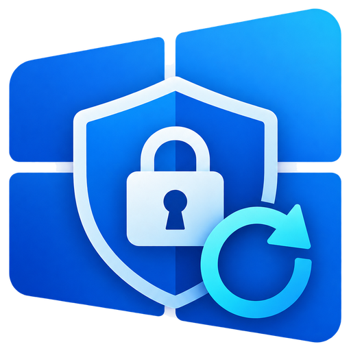

<p align="center">
  
</p>

<h1 align="center">Re-Lock BitLocker</h1>

<p align="center">
  Lock your BitLocker drives again in one click, without restarting Windows.
</p>

<p align="center">
  <a href="https://github.com/shafiei/Re-Lock-BitLocker/releases/latest">
    
  </a>
  <a href="LICENSE">
    
  </a>
  
  <a href="https://github.com/shafiei/Re-Lock-BitLocker/releases">
    
  </a>
</p>

---

## What is Re-Lock BitLocker?

Windows keeps a BitLocker drive open after you unlock it until you restart Windows.

**Re-Lock BitLocker** lets you lock it again immediately, without restarting your computer.

This is useful when you have finished using an encrypted drive and want to lock it again before disconnecting it or leaving your computer.

---

## Features

- Lock BitLocker drives with one click
- Automatically detects BitLocker drives and their current state
- Lock an individual drive or all available drives
- Modern Windows 11-style interface
- Light and dark theme support
- English and Persian interface
- Persian interface supports right-to-left (RTL) layout
- No Windows restart required
- Windows installer
- Portable BAT script
- Free and open source

---

## Download

There are two ways to use Re-Lock BitLocker:

| Version | Best for | Download |
|---|---|---|
| **App** (Recommended) | Everyday use with a modern GUI | [**Download the installer**](https://github.com/shafiei/Re-Lock-BitLocker/releases/latest) |
| **Script** | Quick and portable use | [`Re-Lock-BitLocker.bat`](Re-Lock-BitLocker.bat) |

### Windows App

Download the latest version from:

**[GitHub Releases](https://github.com/shafiei/Re-Lock-BitLocker/releases/latest)**

The installer is self-contained, so you don't need to install .NET separately.

### Portable Script

If you don't want to install anything, you can use:

[`Re-Lock-BitLocker.bat`](Re-Lock-BitLocker.bat)

---

## Screenshot

<p align="center">
  
</p>

---

## Demo

<!-- Replace the URL below with your YouTube video -->

[](https://www.youtube.com/)

Watch the demo to see how Re-Lock BitLocker can lock an unlocked BitLocker drive without restarting Windows.

---

## How to Use

### App

1. Download `ReLockBitLocker-Setup.exe` from the [latest release](https://github.com/shafiei/Re-Lock-BitLocker/releases/latest).
2. Run the installer and follow the steps.
3. Open **Re-Lock BitLocker** from the Start menu.
4. Find the BitLocker drive you want to lock.
5. Click **Lock**.

The application automatically detects your BitLocker drives and shows their current state.

You can also use **Lock all** to lock all available BitLocker drives.

### Script

1. Download [`Re-Lock-BitLocker.bat`](Re-Lock-BitLocker.bat).
2. Double-click the file.
3. Approve the administrator prompt.
4. Enter the number of the drive you want to lock.
5. Enter `A` to lock all drives or `Q` to quit.

---

## Important

### Administrator privileges

Administrator rights are required.

Both the application and the script will request administrator privileges.

### Windows drive

The Windows system drive, usually `C:`, cannot be locked while Windows is running.

### Open files

Re-Lock BitLocker uses **force dismount** when locking a drive.

This means that applications and files still open on the target drive may be closed.

**Save your work and close applications using the drive before locking it.**

### Supported Windows editions

- Windows 10 64-bit
- Windows 11 64-bit
- Windows editions that include BitLocker, such as:
  - Pro
  - Enterprise
  - Education

---

## Windows SmartScreen Warning

Windows may display a **"Windows protected your PC"** warning because the installer is currently not code-signed.

If you downloaded the installer from the official GitHub Releases page and want to run it:

1. Click **More info**
2. Verify that you downloaded the correct release
3. Click **Run anyway**

If you want to verify the downloaded file before running it, compare its SHA-256 hash with the value provided in `SHA256SUMS.txt` in the release.

You can calculate the hash on Windows with:

```powershell
certutil -hashfile ReLockBitLocker-Setup.exe SHA256
```

Only download releases from the official repository:

https://github.com/shafiei/Re-Lock-BitLocker/releases

---

## Security & Transparency

Re-Lock BitLocker is free and open source.

The source code is publicly available on GitHub for inspection and review.

The application is designed to lock an already-unlocked BitLocker drive. It does not require decrypting the drive to perform the locking operation.

Official releases include a SHA-256 checksum file that can be used to verify the downloaded installer.

---

## FAQ

### Does Re-Lock BitLocker decrypt my drive?

No.

The tool is intended to lock an already-unlocked BitLocker drive.

### Do I need to restart Windows?

No.

The main purpose of Re-Lock BitLocker is to let you lock the drive again without restarting Windows.

### Can I lock the `C:` drive?

No.

The Windows system drive cannot be locked while Windows is running.

### Do I need administrator privileges?

Yes.

Administrator privileges are required for the BitLocker locking operation.

### What happens to files that are still open?

The application uses force dismount when locking the drive.

Files and applications using the drive may be closed.

**Save your work before locking the drive.**

### Is Re-Lock BitLocker free?

Yes.

Re-Lock BitLocker is free and open source under the MIT License.

### Do I need to install .NET?

No for the released application.

The Windows application is published as a self-contained application.

---

## Build from Source

### Requirements

- [.NET 8 SDK](https://dotnet.microsoft.com/download/dotnet/8.0)
- [Inno Setup 6](https://jrsoftware.org/isinfo.php) — only required if you want to build the installer

### Build

Run:

```text
build.bat
```

This publishes a self-contained:

```text
ReLockBitLocker.exe
```

to:

```text
app\publish
```

If Inno Setup is installed, the installer is also generated at:

```text
installer\output\ReLockBitLocker-Setup.exe
```

---

## Project Structure

```text
Re-Lock-BitLocker/
│
├── app/          WPF application (C#, .NET 8, WPF-UI)
├── installer/    Inno Setup script and installer assets
├── docs/         Logo and images used by the README
├── .github/      GitHub Actions workflows
│
├── Re-Lock-BitLocker.bat
├── build.bat
├── LICENSE
└── README.md
```

---

## Releases

To publish a new release, create and push a version tag such as:

```text
v1.0.1
```

The GitHub Actions workflow in:

```text
.github/workflows/release.yml
```

automatically builds the installer and attaches it to the GitHub Release together with a checksum file.

See the latest releases:

**[GitHub Releases](https://github.com/shafiei/Re-Lock-BitLocker/releases)**

---

## Contributing

Contributions, bug reports, feature requests, and suggestions are welcome.

If you find a bug or have an idea for improving Re-Lock BitLocker, please open an issue:

**[Open an Issue](https://github.com/shafiei/Re-Lock-BitLocker/issues)**

Pull requests are also welcome.

When reporting a problem, please include:

- Windows version
- Re-Lock BitLocker version
- What you expected to happen
- What actually happened
- Relevant screenshots or error messages

---

## Support the Project

If Re-Lock BitLocker is useful to you, consider giving the project a ⭐ on GitHub.

A star helps the project gain visibility and makes it easier for other Windows users to discover it.

**[⭐ Star Re-Lock BitLocker](https://github.com/shafiei/Re-Lock-BitLocker)**

---

## فارسی

**Re-Lock BitLocker** به شما اجازه می‌دهد درایوهای BitLocker را پس از Unlock شدن، بدون Restart کردن ویندوز دوباره قفل کنید.

### برنامه

فایل `ReLockBitLocker-Setup.exe` را از [صفحه Releases](https://github.com/shafiei/Re-Lock-BitLocker/releases/latest) دانلود و نصب کنید.

سپس برنامه را باز کرده و کنار درایو موردنظر روی **Lock** بزنید.

### اسکریپت

اگر نمی‌خواهید برنامه را نصب کنید، می‌توانید فایل:

`Re-Lock-BitLocker.bat`

را اجرا کنید.

### نکات مهم

- هر دو روش به دسترسی Administrator نیاز دارند.
- درایو ویندوز، معمولاً `C:`، قابل قفل شدن نیست.
- هنگام قفل کردن، درایو با **Force Dismount** جدا می‌شود و فایل‌ها یا برنامه‌های باز روی آن ممکن است بسته شوند.
- قبل از قفل کردن، حتماً فایل‌های خود را ذخیره کنید.
- اگر زبان ویندوز فارسی باشد، رابط برنامه نیز به صورت فارسی و راست‌به‌چپ نمایش داده می‌شود.
- برنامه برای Windows 10 و Windows 11 نسخه 64 بیتی طراحی شده است.

---

## License

Re-Lock BitLocker is released under the **MIT License**.

See the [LICENSE](LICENSE) file for details.

---

## Author

Created by **Shafiei**

[GitHub Profile](https://github.com/shafiei)
